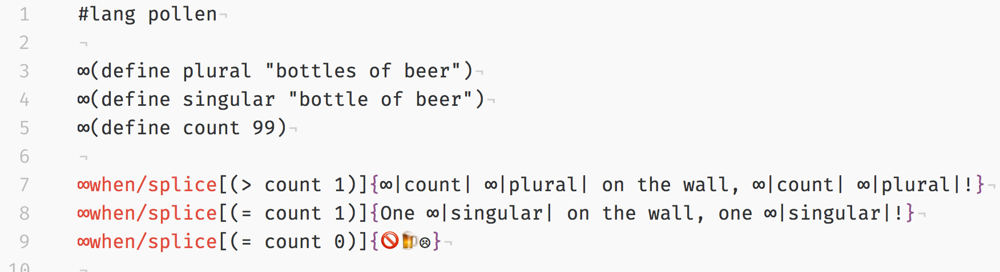

# (Modified) Pollen language package

This package adds syntax highlighting to [_Pollen_](https://docs.racket-lang.org/pollen/) files, with one **important difference compared with the [original package](https://github.com/clozach/language-pollen)**: this fork replaces the typical `◊` command character with `§`.

Why? Because there's no way to type `◊` on an iPhone, but `§` can be had with a long-press on `&`.

(If I had the time, I'd use the strategy from [atom-tasks](https://discuss.atom.io/t/automatically-update-to-dynamic-grammar/10181/4) so that the command character could be loaded from settings. But I don't, so 👅💦.)

# Installation

- Search for _Pollen_ and _Racket_ (optional<a name="footnote">1</a>) in the Atom package manager
\~ or ~
- Run `apm install language-racket language-pollen`

---

[1](#footnote)`language-racket` is not an explicit dependency of this project. That said, Pollen source files can contain [_Racket_](https://racket-lang.org/) code, so you'll probably want to install both:

_Pollen only_ (w/`§` command character)

_Pollen with Racket_ (w/`§` command character)

